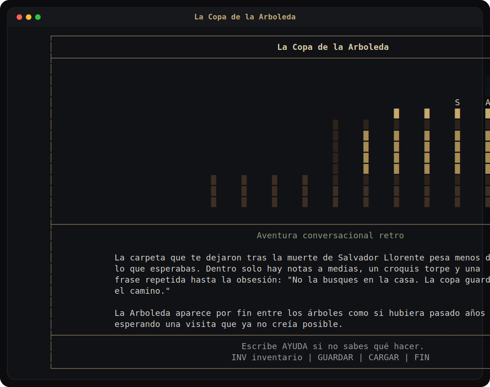
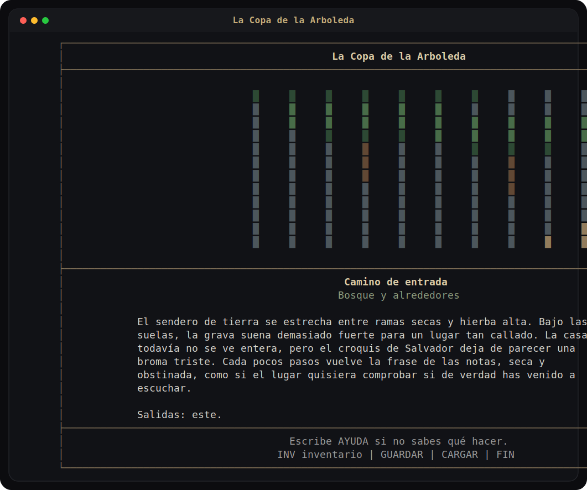
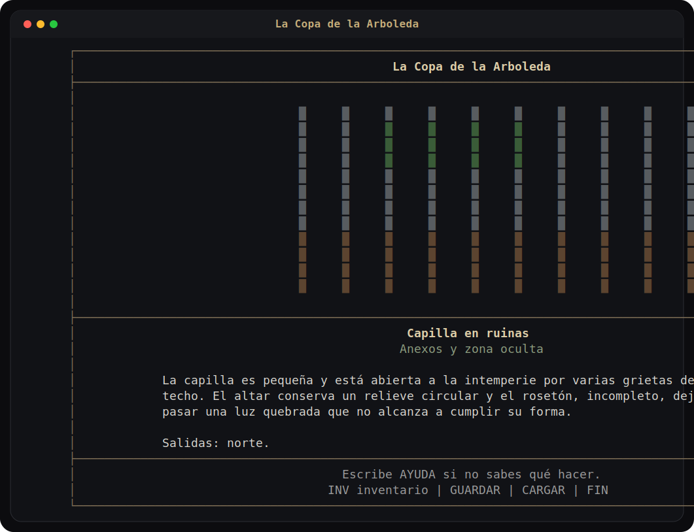
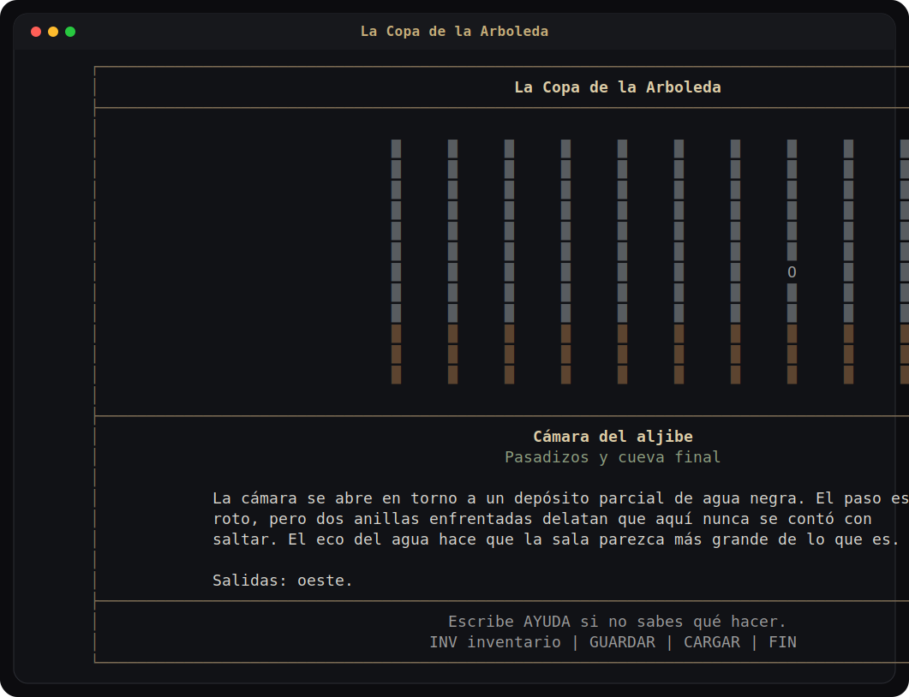

# La Copa de la Arboleda

<p align="center">
  Aventura conversacional retro para consola, escrita en Python, con parser controlado, exploracion pausada y misterio rural.
</p>

<p align="center">
  
  
  
  
</p>

## Capturas

<p align="center">
  
  
</p>

<p align="center">
  
  
</p>

## Premisa

Tras la muerte de un familiar solitario, el protagonista recibe una carpeta con notas incompletas, un croquis torpe y una frase repetida hasta la obsesion:

> "No la busques en la casa. La copa guarda el camino."

Lo que empieza como la busqueda de una copa de plata acaba convirtiendose en una exploracion de la finca de La Arboleda, sus anexos olvidados y una zona subterranea sellada durante decadas.

## Que ofrece el proyecto

- aventura conversacional original con tono de misterio, melancolia y tension suave
- motor modular en Python 3.12, sin framework grafico ni app web
- parser V1 corto, claro y deliberadamente acotado
- 24 habitaciones, 4 zonas y progresion completa definida desde el inicio
- contenido authored en JSON, separado del runtime
- una sola pantalla limpia por interaccion, con escenas pixeladas austeras dentro de la consola
- guardado y carga de partida en local

## Filosofia de diseno

La experiencia esta pensada para:

- explorar con calma
- observar antes de actuar
- reconstruir el espacio mentalmente
- tomar notas
- dibujar el mapa en papel si apetece

No busca:

- parser de lenguaje libre
- ayudas invasivas
- mapa automatico
- motor grafico
- interfaz moderna tipo visual novel

## Estado actual

El repositorio contiene una version base jugable de principio a fin con:

- parser, inventario, flags, interacciones y persistencia
- mundo completo cargado desde datos
- finales principal y variante
- pruebas automatizadas con `unittest`
- documentacion de diseno y de arquitectura

## Puesta en marcha

### Windows

Crear y activar el entorno virtual:

```powershell
py -3.12 -m venv .venv
.venv\Scripts\Activate.ps1
python -m pip install --upgrade pip
python -m pip install -e .
```

Ejecutar el juego:

```powershell
python -m game
```

Tambien puedes usar el lanzador:

- `JUGAR_LA_COPA.bat`

### WSL

```bash
cmd.exe /c py -3.12 -m venv G:\\juegopcaventuraconversacional\\.venv
/mnt/g/juegopcaventuraconversacional/.venv/Scripts/python.exe -m pip install -e /mnt/g/juegopcaventuraconversacional
/mnt/g/juegopcaventuraconversacional/.venv/Scripts/python.exe -m game
```

## Comandos utiles

- `MIRAR`, `MIRA`, `VER`
- `EXAMINAR OBJETO`
- `NORTE`, `SUR`, `ESTE`, `OESTE`, `ARRIBA`, `ABAJO`
- `COGER`, `COGE`, `RECOGE`
- `USAR OBJETO EN OBJETO`
- `LEER`, `ABRIR`, `EMPUJAR`, `TIRAR`
- `INVENTARIO`, `AYUDA`, `GUARDAR`, `CARGAR`, `FIN`

La ayuda completa para jugar esta en:

- `MANUAL_JUGADOR.md`

## Documentacion del proyecto

- `MANUAL_JUGADOR.md`: manual breve para jugar
- `STATE.md`: fotografia operativa del repositorio
- `docs/`: especificacion de diseno, narrativa y arquitectura
- `docs/RUNBOOK.md`: preparacion de entorno, ejecucion y reglas de trabajo

## Desarrollo

Ejecutar pruebas:

```bash
python -m unittest discover -s tests -p "test_*.py"
```

Regenerar capturas del README:

```bash
python scripts/generate_readme_assets.py
```

## Estructura

```text
.
├── data/
│   ├── saves/
│   └── world/
├── docs/
├── scripts/
├── src/
│   └── game/
├── tests/
├── AGENTS.md
├── JUGAR_LA_COPA.bat
├── MANUAL_JUGADOR.md
├── README.md
└── STATE.md
```

## Principios tecnicos

- Python simple antes que complejidad gratuita
- biblioteca estandar primero
- contenido separado del motor
- cambios pequenos y trazables
- arquitectura mantenible antes que "brillante"

## Nota sobre las capturas

Las capturas del README se generan desde el propio runtime del juego y se exportan como SVG para que puedan versionarse y mantenerse dentro del repositorio.
